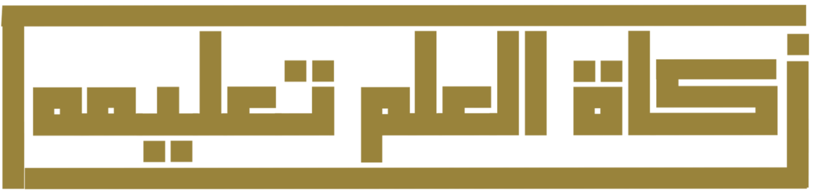

<html>

<head>
    <meta charset="utf-8">
    <meta http-equiv="X-UA-Compatible" content="IE=edge">
    <title>Rpm</title>
    <meta name="description" content="">
    <meta name="viewport" content="width=device-width, initial-scale=1">
    <link rel="stylesheet" href="Header.css">
    <link rel="stylesheet" href="https://cdnjs.cloudflare.com/ajax/libs/font-awesome/4.7.0/css/font-awesome.min.css">
    <link rel="stylesheet" href="Styles/Header.css">
    <link rel="stylesheet" href="Styles/Footer.css">
    <link rel="stylesheet" href="Styles/Buttons.css">
    <link rel="stylesheet" href="Styles/Card.css">
    <link rel="stylesheet" href="Styles/Typography.css">
    <link rel="stylesheet" href="css/suii.css">
    <link rel="preconnect" href="https://fonts.googleapis.com">
    <link rel="preconnect" href="https://fonts.gstatic.com" crossorigin>
    <link href="https://fonts.googleapis.com/css2?family=Inter:wght@100..900&display=swap" rel="stylesheet">

</head>

<body>
    <header>
        <button class="btn_logo">Logo</button>

        <nav>
            <ul class="headers_links">
                <ul class="header_list">
                    <li><a class="active" href="#">Home</a></li>
                    <li><a href="About us.html">About us</a></li>
                    <li><a href="Contact us.html">Contact us</a></li>
                    <li><a href="Achievements.html">Achievements</a></li>
                    <a href="Sign in.html">
                        <button class="btn_Sign_in">Sign in</button>
                    </a>
                    <a href="Sign up.html">
                        <button class="btn_Sign_up">Sign Up</button>
                    </a>
                </ul>
            </ul>
        </nav>

    </header>

    

        <h1>Contact Us </h1>

        

            <label>Phone number</label>
             
            <input type="number">
             
            <label>Email </label>
             
            <input type="email" required width="50px" height="1000px">
             
            <label>Full name </label>
             
            <input type="text">
             
            <label> What's your major? </label>
             
            <input type="text" width="600px">
             
            

                <label>Message us </label>
                 
                <input type="text">
            

             
            

                <button> Send </button>
            

        

    

    </header>
</body>
<footer>
    

        <!--  -->
    

    <nav>

        <ul class="footerContainer">
            <button class="cta_footer">Logo</button>
            <ul class="socialIcons">
                <a href="#"><i class="fa fa-facebook"></i>
                    <a href="#"><i class="fa brands fa-instagram"></i>
                        <a href="#"><i class="fa brands fa-twitter"></i>
                            <a href="#"><i class="fa brands fa-youtube"></i>
            </ul>

            <ul class="footer_links">
                <li><a class="Copyright">Copyright &copy;2024 Designed by RPM team</a></li>
                <li><a class="footer_home" href="#">Home</a></li>
                <li><a href="About us.html">About us</a></li>
                <li><a href="Contact us.html">Contact us</a></li>
                <li><a href="Achievements.html">Achievements</a></li>
            </ul>
        </ul>
    </nav>

</footer>

</html>
css
@import url('https://fonts.googleapis.com/css2?family=Roboto:ital,wght@0,100;0,300;0,400;0,500;0,700;0,900;1,100;1,300;1,400;1,500;1,700;1,900&display=swap');
@import url('https://fonts.googleapis.com/css2?family=Inter:wght@100..900&family=Roboto:ital,wght@0,100;0,300;0,400;0,500;0,700;0,900;1,100;1,300;1,400;1,500;1,700;1,900&display=swap');
@import url('https://fonts.googleapis.com/css2?family=Roboto:ital,wght@0,100;0,300;0,400;0,500;0,700;0,900;1,100;1,300;1,400;1,500;1,700;1,900&display=swap');
@import url('https://fonts.googleapis.com/css2?family=Inter:wght@100..900&family=Roboto:ital,wght@0,100;0,300;0,400;0,500;0,700;0,900;1,100;1,300;1,400;1,500;1,700;1,900&display=swap');

/* styling footer */

/* Reset  */
* {
    margin: 0px;
    padding: 0px;
    box-sizing: border-box;
    font-family: "Inter", sans-serif;
}

/* Variables */
:root {
    --white: white;
    --primary_color: #2D3648;

}

/* the used page lights up */
.active {
    color: var(--primary_color);
    text-decoration: underline;
}

/* styling the header */
header {
    display: flex;
    justify-content: space-between;
    align-items: center;
    background-color: var(--white);
    height: 96px;
    padding-left: 100px;
    padding-right: 236px;
    text-decoration: none;

}

.headers_links {
    list-style: none;
}

.headers_links li {
    display: inline-block;
    padding: 0px 20px;
}

.headers_links li a {
    transition: all 0.3s ease 0s;
}

.headers_links li a:hover {
    color: var(--primary_color);
}

.yusuf {
    width: 1645.67;
    height: 709;
    margin-block: 203, 137, 137, 453.33;
}

.yusuf h1 {
    width: 414px;
    height: 50px;
    color: #2D3648;
    margin-top: 103px;
    margin-left: 137px;
    margin-bottom: 1072.3px;
    margin-right: 1369px;
    font-size: 74.67px;
    font-family: "Inter", sans-serif;
    font-weight: bold;
}

.YA74 {
    width: 1645.33;
    height: 549.33;
    position: absolute;
    top: 362.67px;
    right: 137.33px;
    left: 68.665px ;
    bottom: 380px;
    background-color: lightblue;
    color: #2D3648;
    font-size: 18.67px;
    font-weight: 600;
    font-family: "Inter", sans-serif;
    border-radius: 50px;
    padding: 53.33px;

}

.YA74 input {
    width: 426.66687px;
    height: 64px;
}

.m input {
    width: 870.67px;
    height: 177.33px;
    position: absolute;
    left: 694px;
    top: 155.67px;
    right: 80.67px;
    bottom: 216.33px;
    border-radius: 8px;
}

.m label {
    position: absolute;
    left: 694px;
    top: 155.67px;
    right: 80.67px;
    bottom: 216.33px;
    border-radius: 8px;
}

.yyy button {
    width: 124px;
    height: 56px;
    background-color: #2D3648;
    color: white;
    font-family: "Inter", sans-serif;
    position: absolute;
    top: 370.33px;
    right: 80.67px;
    left: 1440.67px;
    bottom: 123px;
    border-radius: 53.33px;
}

* {
    margin:0px  ;
    padding: 0px;
    box-sizing: border-box;
    font-family: "Inter", sans-serif;
}

footer {
    background-color: #1A202C;
    width: 100%;
}

.footerContainer {
    width: 100%;
    padding-left: 104px;
}

.footer_links li {
    margin-left: px;
}

.footer_links li {
    display: inline-block;
    padding: 0px 20px;
}

.Copyright {
    margin-right: 570px;
    margin-bottom: 30px;
    margin-top: 20px;
}
